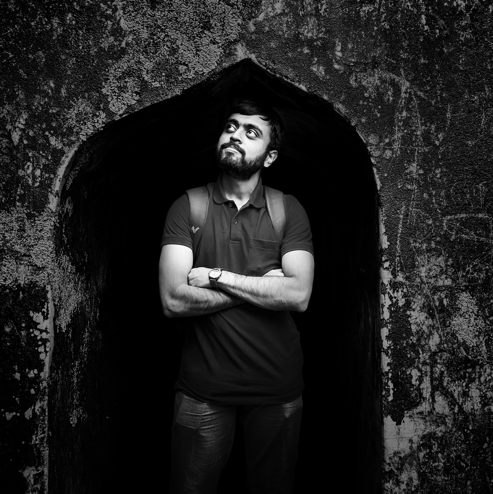

## Hello👋, I'm Nithish Krishnabharathi Gnani  
  

<a href="https://linkedin.com/in/nithish-k-gnani" target="_blank">

<!-- </a>
 -->
<!--  -->
<!--  -->
  

## About me  

<table><tr><td valign="top" width="70%">

- 🎓 Dual MSc student in Autonomous Systems and Intelligent Robots at the Polytech Nice Sophia, France and KTH Royal Institute of Technology, Sweden 
  
- 💼 Former Technical Associate at Indian Institute of Science      

- 🏭 Former Team Lead in Manufacturing at Coca-Cola    

- 🎓 Mechanical Engineering Graduate from NIT Karnataka (NITK), Surathkal, India  

</td><td valign="top" width="30%">

  

</td></tr></table>  

---

GitHub Stats:

Joined Github **9** years ago.

Since then I pushed **1049** commits, opened **2** issues, submitted **40** pull requests, received **35** stars across **33** personal projects and contributed to **1** public repositories.

<!-- 
Most used languages across my projects:

 -->

GitHub stats generated using <a href="https://github.com/marketplace/actions/profile-readme-stats">teoxoy/profile-readme-stats</a>

