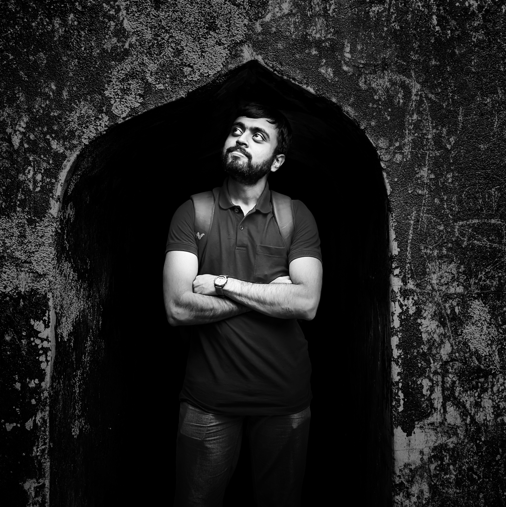

<!--
### Hi there 👋

**nithishkgnani/nithishkgnani** is a ✨ _special_ ✨ repository because its `README.md` (this file) appears on your GitHub profile.

Here are some ideas to get you started:

- 🔭 I’m currently working on ...
- 🌱 I’m currently learning ...
- 👯 I’m looking to collaborate on ...
- 🤔 I’m looking for help with ...
- 💬 Ask me about ...
- 📫 How to reach me: ...
- 😄 Pronouns: ...
- ⚡ Fun fact: ...
-->

## Hello👋, I'm Nithish K Gnani  
  

  

## About me  
I'm Nithish K Gnani, a researcher at Indian Institute of Science (IISc), Bangalore.
I work with tactile internet, deterministic networks, cyber physical systems, IoT data management among other research areas in electronic systems.  
  

 

<table><tr><td valign="top" width="70%">

- 🔍 Research on [Tactile Internet and Cyber Physical Systems](https://labs.dese.iisc.ac.in/zenlab/ongoing-projects/tsn/)  
  
- 💼 Working at Indian Institute of Science      

- 🏭 Former Team Lead in Manufacturing at Coca-Cola    

- 🎓 Mechanical Engineering Graduate from NIT Karnataka (NITK), Surathkal, India  

</td><td valign="top" width="30%">

  

</td></tr></table>  

---

GitHub Stats:

Joined Github **{{ ACCOUNT_AGE }}** years ago.

Since then I pushed **{{ COMMITS }}** commits, opened **{{ ISSUES }}** issues, submitted **{{ PULL_REQUESTS }}** pull requests, received **{{ STARS }}** stars across **{{ REPOSITORIES }}** personal projects and contributed to **{{ REPOSITORIES_CONTRIBUTED_TO }}** public repositories.

Most used languages across my projects:

{{ LANGUAGE_TEMPLATE_START }}

{{ LANGUAGE_TEMPLATE_END }}

Generated using <a href="https://github.com/marketplace/actions/profile-readme-stats">teoxoy/profile-readme-stats</a>

